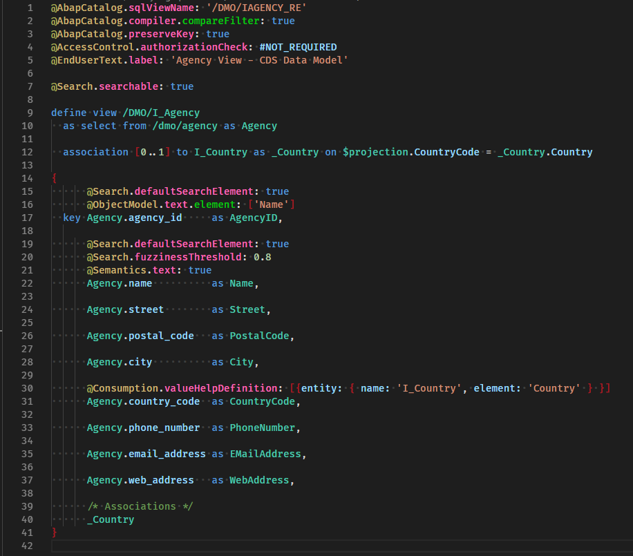

# Vscode-ABAP-CDS


## Description

Language support for ABAP CDS views. Includes syntax higlighting and code snippets.

If you're looking for CDS for SAP Cloud Platform Application Programming Model (CAP), you won't find it in the marketplace yet. However, you can download it as a .vsix from [here](https://tools.hana.ondemand.com/#hanatools).


## Requirements

An up-to-date Visual Studio Code installation is all you need.

## Download and Installation

You can install the extension from within the editor or from the marketplace:
https://marketplace.visualstudio.com/items?itemName=hudakf.cds

## Configuration

If you want to customize the token colors, add an `editor.tokenColorCustomizations` section to your vscode `settings.json`. The following example will change the color of annotations. You can color the annotation symbol as well as each "level" of member access separately, up to 5 levels.

```json
"editor.tokenColorCustomizations": {
    "textMateRules": [
        {
            "scope": "comment.line.annotation.symbol.abapcds",
            "settings": {
                "foreground": "#a8ad5b"
            }
        },
        {
            "scope": "comment.line.annotation.property.abapcds",
            "settings": {
                "foreground": "#d0f38e"
            }
        },
        {
            "scope": "comment.line.annotation.property.lvl1.abapcds",
            "settings": {
                "foreground": "#cfb879"
            }
        },
        {
            "scope": "comment.line.annotation.property.lvl2.abapcds",
            "settings": {
                "foreground": "#ff6abc"
            }
        },
        {
            "scope": "comment.line.annotation.property.lvl3.abapcds",
            "settings": {
                "foreground": "#02cc0c"
            }
        },
        {
            "scope": "comment.line.annotation.property.lvl4.abapcds",
            "settings": {
                "foreground": "#bee437"
            }
        },
        {
            "scope": "comment.line.annotation.property.lvl5.abapcds",
            "settings": {
                "foreground": "#ffef0d6c"
            }
        },
    ]
},
```

- Color of braces/brackets:

```json
{
    "scope": "punctuation.abapcds",
    "settings": {
        "foreground": "#e71527af"
    }
}
```

Light up your code like a christmas tree!


## Known issues

The highlighting grammar is a very simplified version of the ABAP CDS language structure. 99% of the language should be covered correctly, but some more complicated constructs can be higlighted unexpectedly. If you see anything outright wrong, please create an issue.

## How to obtain support

Create a new issue in this repository.

## Contributing

Small pull requests are welcome. Describe your change in the pull request. You will find everything you need to know about how the extension works at https://code.visualstudio.com/api/language-extensions/overview.
