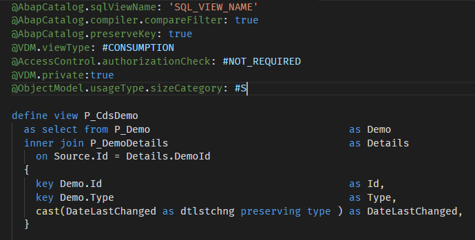

# Vscode-ABAP-CDS


## Description

Language support for ABAP CDS views. Includes syntax higlighting and code snippets.

If you're looking for CDS for SAP Cloud Platform Application Programming Model (CAP), you won't find it in the marketplace yet. However, you can download it as a .vsix from [here](https://tools.hana.ondemand.com/#hanatools).



## Requirements

An up-to-date Visual Studio Code installation is all you need.

## Download and Installation

You can install the extension from within the editor or from the marketplace:
https://marketplace.visualstudio.com/items?itemName=hudakf.cds

## Configuration

If you want to customize the token colors, add an `editor.tokenColorCustomizations` section to your vscode `settings.json`. The following example will change the color of annotations:

```json
"editor.tokenColorCustomizations": {
      "[Default Dark+]": {
        "textMateRules": [
          {
            "scope": "comment.line.annotation.symbol.abapcds",
            "settings": {
              "foreground": "#40c386"
            }
          },
          {
            "scope": "comment.line.annotation.property.abapcds",
            "settings": {
              "foreground": "#bbbda0"
            }
          }
        ]
      }
    }
```

## Known issues

The highlighting grammar is a very simplified version of the ABAP CDS language structure. Therefore, some names which are identical to keywords can get keyword higlighting, because the grammar cannot tell them apart.

## How to obtain support

Create a new issue in this repository.

## Contributing

Small pull requests are welcome. Describe your change in the pull request. You will find everything you need to know about how the extension works at https://code.visualstudio.com/api/language-extensions/overview.

## License

Copyright (c) 2019 SAP SE or an SAP affiliate company. All rights reserved.
This file is licensed under the SAP Sample Code License except as noted otherwise in the [LICENSE](license.md) file.
